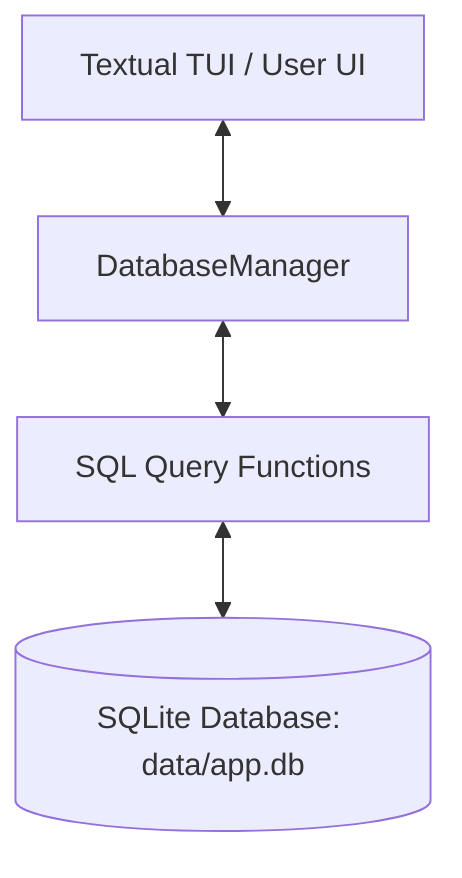

# 🗄️ VoidChat Database Module

This module provides the local storage engine for **VoidChat**, a decentralized local-first chat application. It manages persistence for users, conversations, messages, and file transfers using a robust **SQLite** backend wrapped in a clean, developer-friendly Python interface.

---

## 📂 File Structure

The `database` folder contains the following core files:

1. **[`core.py`](./core.py)**: The main database logic file. It defines the database schema, SQLite connection management, Python data models (dataclasses), SQL query functions, and the high-level `DatabaseManager` interface.
2. **[`utils.py`](./utils.py)**: Helper utilities for database operations, including UUID generation, UTC ISO timestamping, file chunk path construction, and directory maintenance.
3. **`data/app.db`** (Auto-generated): The SQLite database file created dynamically on initialization to store all system states persistently.

---

## 🏗️ Architecture & Database Logic

The database logic is structured in three logical layers:



### 1. Connection & Config
- **File Database**: The DB is stored locally at `data/app.db` under the project root.
- **Foreign Keys**: Enforced using SQLite's `PRAGMA foreign_keys = ON` to guarantee absolute data integrity.
- **Row Factory**: Connects with `sqlite3.Row` row factory so query results can be fetched as convenient dictionary-like rows.

### 2. Python Data Models (`dataclasses`)
The system uses native Python dataclasses to represent tables and facilitate structured, type-safe data transfers:
* **`User`**: Local and remote peer information (ID, username, public key, IP address, status, last seen).
* **`Conversation`**: Group or 1-to-1 chat sessions (ID, title, timestamps).
* **`ConversationParticipant`**: Junction table mapping users to their respective conversations.
* **`Message`**: Encrypted text content with delivery status, timestamps, and sender/receiver IDs.
* **`FileMetadata`**: File transfers (filename, size, checksum, total chunks, transfer status).
* **`FileChunk`**: Binary file fragments stored locally to support chunked file transfers.

---

## 🔄 Data Lifecycle & Flow

Here is a detailed breakdown of how data travels from user inputs, to SQLite on disk, and back to the User Interface.

### 📥 1. Data Ingestion: How Data Arrives & Its Format
When the user or a remote peer performs an action (e.g., logging in, sending a message, starting a file transfer):
1. **Format**: Inputs are gathered from the UI widgets (like `Input` text inputs in `ui/login.py`).
2. **Cryptographic Wrapping**: For messages, the text is encrypted using the cryptographic module (`crypto/encrypt.py`).
3. **Dataclass Construction**: The UI or protocol layers construct a Python `dataclass` instance (e.g. `Message` or `User`) using helpers from `database/utils.py` (e.g., `generate_uuid()` and `current_timestamp()`).

### 💾 2. Data Storage: How Data is Persisted
1. The developer interacts with the single interface: **`DatabaseManager`**.
2. **Serialization**: The `DatabaseManager` calls SQL query functions (like `add_message()` or `add_user()`).
3. **Execution**: The manager issues secure SQL statements with parameter binding to prevent any SQL injection:
   ```python
   # Example under the hood
   cursor.execute(
       "INSERT OR REPLACE INTO users (user_id, username, ...) VALUES (?, ?, ...)", 
       (user.user_id, user.username, ...)
   )
   ```
4. **Transaction Commit**: `connection.commit()` commits the changes down to the `data/app.db` binary file on disk.

### 📤 3. Data Retrieval: How UI Fetches & Renders Data
To display conversations, messages, or peer lists on the terminal UI screen:
1. **Invocation**: The UI invokes a retrieval method on `DatabaseManager` (e.g. `db_manager.get_messages(conversation_id)`).
2. **Querying SQLite**: The manager executes a structured `SELECT` query:
   ```sql
   SELECT * FROM messages WHERE conversation_id = ? ORDER BY timestamp ASC
   ```
3. **Dictionary-Like Parsing**: Results are returned as list of `sqlite3.Row` instances.
4. **UI Binding**: The UI loops through these records, maps them to reactive attributes, and binds them directly to custom Textual widgets (e.g., rendering bubbles or text lists), displaying the real-time or historical data instantly to the user.

---

## 🛠️ Utility Helpers (`utils.py`)

- **`generate_uuid()`**: Generates high-entropy standard UUIDv4 strings for all system IDs.
- **`current_timestamp()`**: Retrieves unified `ISO 8601` format UTC timestamps to ensure consistent timezones across different network nodes.
- **`build_chunk_path()`**: Generates structured binary paths (`base_dir / file_id_chunk_index.bin`) to save and track raw file chunk uploads and downloads.
